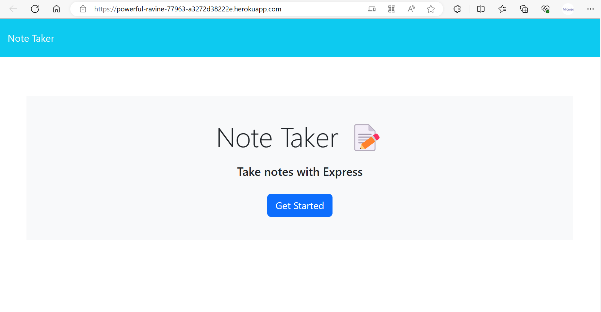
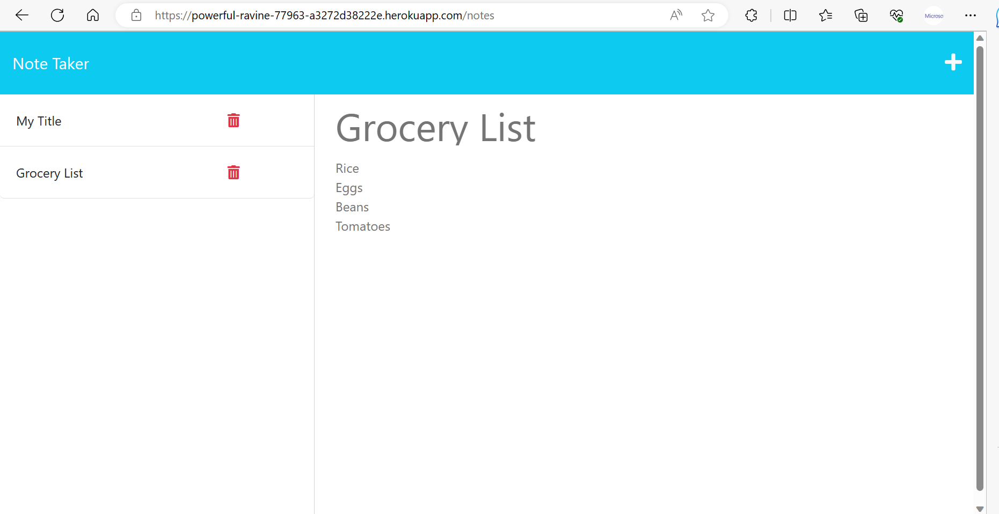

# Note Taker
 


## Table of Contents

- [Description](#description)
- [Technologies](#technologies)
- [Installation](#installation)
- [Usage](#usage)
- [License](#license)


## Description

The project aims to modify the provided starter code to create an application called Note Taker that can be used to write and save notes. This application will use an Express.js back end and will save and retrieve note data from a JSON file. Then, connect the application's front end that has already been created and the back end, and then deploy the entire application to Heroku.


## Technologies

- JavaScript (Client-side web development)
- Node.js (A runtime environment and server-side web development platform for JavaScript)
- Express.js (Web application framework for Node.js)
- NPM (Node Package Manager for Node.js)
- JSON (JavaScript Object Notation is a standard text-based format for representing structured data based on JavaScript object syntax)
- Heroku (A cloud platform)


## Installation

In order to be able to run the applicaton, you are required to do the following:

- Install Nodjs on your computer by downloading it from their website here, https://nodejs.org/en.
- If you are not sure how to install it. Click here for the instruction, https://coding-boot-camp.github.io/full-stack/nodejs/how-to-install-nodejs.
- Download the zip file/ clone the GitHub repo 
- Install npm (Node Package Manager) inside the repo by typing the following code in the command line:
```bash
 $ npm install
 ```


## Usage

To use the application,
- Click the "Get Started" button to open the note-taking app.
- Click "Note Title" and type your note title.
- Click "Note Text" and type your notes.
- Then, the "Save" button icon will appear in the right corner, next to the "+" sign. Click it to save your note.
- Click on the saved note title to see the notes in it.
- Click the "+" icon to add another note.
- Click the trash icon to delete saved notes.
- Visit the live website. [Click here](https://powerful-ravine-77963-a3272d38222e.herokuapp.com/)


Preview the screenshot:




## License

This project is under the MIT License. [Click here for more information](https://opensource.org/licenses/MIT).

