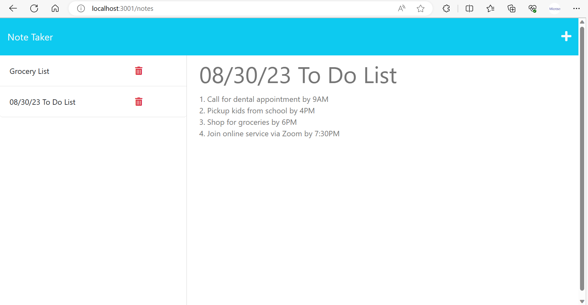

# Note Taker
 


## Table of Contents

- [Description](#description)
- [Technologies](#technologies)
- [Installation](#installation)
- [Usage](#usage)
- [License](#license)


## Description

The project aims to modify the provided starter code to create an application called Note Taker that can be used to write and save notes. This application will use an Express.js back end and will save and retrieve note data from a JSON file.

The application’s front end has already been created. It's your job to build the back end, connect the two, and then deploy the entire application to Heroku.


## Technologies

- JavaScript (Client-side web development)
- Node.js (A runtime environment and server-side web development platform for JavaScript)
- Express.js (Web application framework for Node.js)
- NPM (Node Package Manager for Node.js)
- JSON


## Installation

In order to be able to run the applicaton, you are required to do the following:

- Install Nodjs on your computer by downloading it from their website here, https://nodejs.org/en.
- If you are not sure how to install it. Click here for the instruction, https://coding-boot-camp.github.io/full-stack/nodejs/how-to-install-nodejs.
- Install express.js on your computer. [Click here for complete guide:](https://expressjs.com/en/starter/installing.html)
```bash
 $ npm install express
 ```
 - Download/ clone the GitHub repo 
- Install npm (Node Package Manager) inside the repo by typing the following code in the command line:
```bash
 $ npm install
 ```


## Usage

To use the application,
- Visit the live website. [Click here to visit](Insert the link here)


Preview the screenshot:




## License

This project is under the MIT License. [Click here for more information](https://opensource.org/licenses/MIT).

